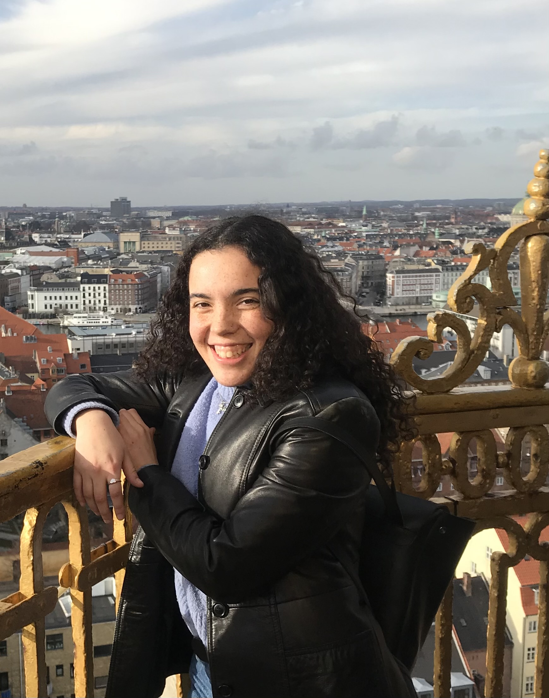
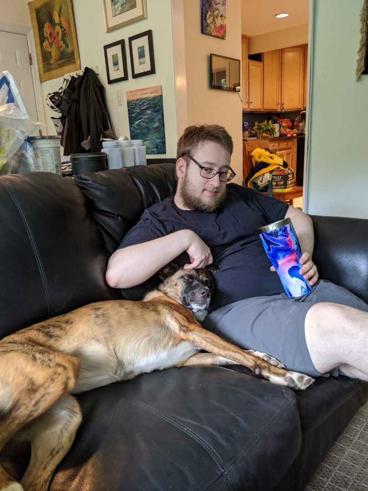
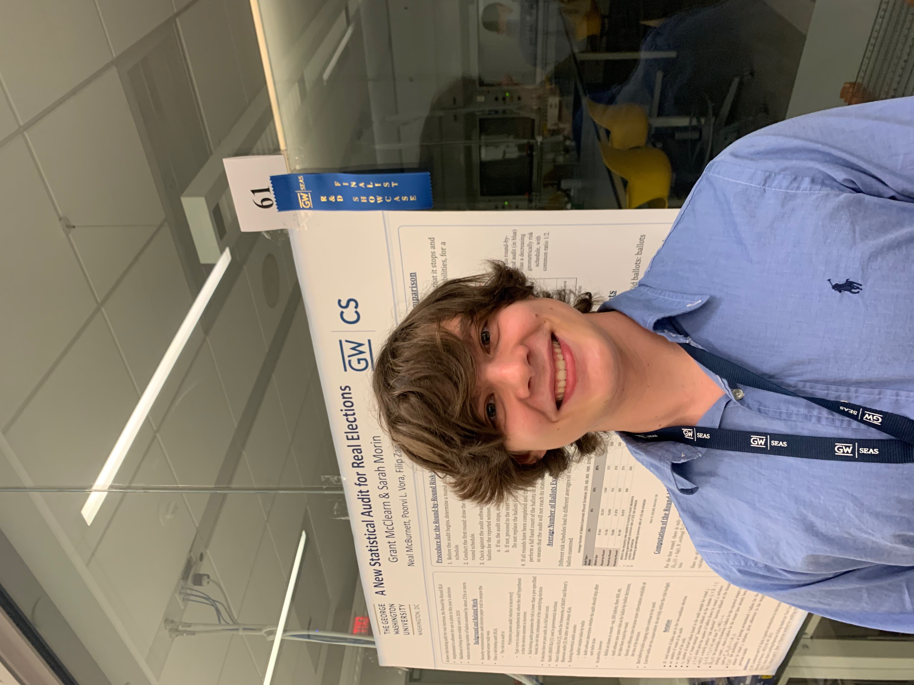

## Meet The Team

Lily is from Newtown-upon-Winnipesaukee, New Hampshire. She's a senior CS major at GWU (but not for long!). In the fifth grade, she correctly guessed that there were seven hundred and eighty-six Jelly Belly jelly beans in a jar, and so got to take all of them home (much to the chagrin of her peers). In her free time, she enjoys running on the National Mall, going to amusement parks with adequate social distancing measures, and mountain biking. Her ultimate goal is to empower folks through fitness technology like Fitbit.

  

Julia was raised on the Upper East Side of Manhattan. From a very young age, she manifested an intense interest in vacuum cleaners, which eventually blossomed into her interest in Computer Science; she is also a senior CS major. Her vacuum cleaner interest has since waned, but she is still a die-hard Dyson fangirl. In her free time, she loves going to Wendy's with her family and friends, and selling spare computer parts that she extracts from her father's work computer. Her dream job is software engineer; she loves puzzling out algorithmic problems wherever she can find them.

       

Harmon was born and bred in Vienna, Virginia. He is an avid student of Computer Science and History. His top three favorite wars are, in no particular order,
the Russo-Japanese War, the War of the Seventh Coalition, and the First World War. He loves to go between his home and the actual Vienna in Austria. The latter has a superior opera scene, better street food options, and all around good vibes. Otherwise, he spends his days re-reading Shakespeare's Hamlet and watching Catfish: The TV Show. He wants to work in the (admittedly small) intersection of CS and History. AI techniques have already been used to help generate the likenesses of some ancient Roman emperors!

     

Grant is from Greensboro, North Carolina. He's a senior in CS, but his DegreeMap still erroneously lists him as Pre-Med too. He owns a shirt of Martin van Buren, the eighth president of the United States. He was able to successfully--and easily--discern between Tastycake and Hostess cupcakes in a blind taste test. When he's not going to school or Potbelly Sandwich Shop, he can be found playing Mario Kart with his roommates or marvelling at the number of sirens one hears in DC. He likes the more mathy parts of CS, and wants to stay in school for a long, long time.

     
## Project Presentation &nbsp;&nbsp;&nbsp;&nbsp;&nbsp;&nbsp;&nbsp;&nbsp;&nbsp;&nbsp;&nbsp;&nbsp; Commercial Screencast
<iframe width="400" height="315"
src="https://www.youtube.com/embed/dQw4w9WgXcQ" style="float:left">
</iframe>

<iframe width="400" height="315"
src="https://www.youtube.com/embed/dQw4w9WgXcQ" style="float:right">
</iframe>

              

## Links
[Writing 1: Lily](https://docs.google.com/document/d/18vYd3yrTZhru_3RXhJX7MchKTurhbP4zYAZf3kKtYlg/edit?usp=sharing)
 
[Writing 1: Julia](https://docs.google.com/document/d/11a1AoPKB3UaSG4_sbZlA5f0Z1zwba3j-3K_sYU2to3M/edit?usp=sharing)
 
[Writing 1: Harmon](https://docs.google.com/document/d/1zHGMa8pKH3w7705ruEzwGBe2GaEZ4VsFIe4rIratu9o/edit?usp=sharing)
 
[Writing 1: Grant](https://docs.google.com/document/d/1q4VrKB_sx93x4b4PrGZI8Ai9tB1i6YjCT_4KtHpitP8/edit?usp=sharing)
 
[Writing 2](https://docs.google.com/document/d/1ZbGIxXBxLTfAsBrAB8QHNSQyxrR6OODzxIw3ACiqtyg/edit?usp=sharing)
 
[Writing 3](https://docs.google.com/document/d/1b-qc_T9XAMBMcSU9Ic3yM1XbbD7eLSl1BxPrD0rEVOY/edit?usp=sharing)
 
[Final Report](url)
